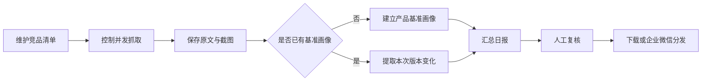

# AIGC 竞品态势感知 Agent

一个面向 AIGC 产品运营与产品经理的竞品研究原型。它把原本分散的“逐站浏览—截图记录—前后版本对比—日报整理”串成一条可重复执行的工作流，帮助使用者更快发现值得跟进的产品变化，并保留原始页面与截图供人工复核。

> 项目定位：用于验证竞品情报工作流与产品方案的个人原型，不是生产级监控服务。仓库中的报告与页面快照是演示数据，模型结论仍需人工判断。

## 为什么做这个项目

在日常 AIGC 竞品研究中，我遇到三个高频问题：

- 站点多、重复浏览耗时，信息容易遗漏；
- 截图、原文和分析结论分散，复盘时缺少上下文；
- 大模型能加速总结，但容易把历史信息误写成当日变化。

因此我将流程定义为：

`站点配置 → 控制并发抓取 → 原文与截图存证 → 基准画像 / 增量对比 → 日报汇总 → 人工复核与分发`

## 当前可体验内容

- **监控配置**：维护竞品站点清单并控制是否启用；
- **抓取存证**：以 3 并发抓取网页正文并保存渲染截图；
- **双轨分析**：首次抓取建立基准画像，后续运行输出版本差异；
- **日报归档**：按运行时间保存 Markdown 日报，避免同日多次运行互相覆盖；
- **可视化控制台**：查看监控概览、历史报告、竞品档案与截图证据；
- **结果分发**：支持下载 Markdown，并可选推送至企业微信群机器人。

仓库当前包含一组可直接查看的演示产物：

| 可核验产物 | 数量 |
| --- | ---: |
| 已配置竞品站点 | 16 |
| 基准画像 / 最新快照 | 16 |
| 网页截图存证 | 16（不计测试截图） |
| 历史日报 | 3 |


## 产品与工作流设计



工作流由 4 个 LangGraph 节点串联：`crawl_all`、`compare_all`、`generate_report`、`push_to_wecom`。LangGraph 在这里用于表达任务状态和节点顺序；当前版本仍是线性原型，不包含复杂的条件分支或自动纠错代理。

## 快速开始

### 1. 准备环境

建议使用 Python 3.11：

```bash
python -m venv .venv
.venv\Scripts\activate
python -m pip install -r requirements.txt
crawl4ai-setup
```

macOS / Linux 激活命令为：

```bash
source .venv/bin/activate
```

### 2. 配置模型

复制 `.env.example` 为 `.env`，然后填写 OpenAI 兼容接口信息：

```bash
copy .env.example .env
```

`.env` 默认已被 Git 忽略。控制台会对已保存的 Key 做掩码显示，但 Key 仍以本地明文配置文件保存，请只在可信设备中使用。

### 3. 查看控制台

```bash
python -m streamlit run app.py
```

浏览器访问 `http://localhost:8501`。即使没有配置 API Key，也可以查看仓库中已有的演示报告、档案和截图；执行新一轮监控前需要先完成模型配置。

Windows 也可以双击 `run_gui.bat`。脚本会自动以当前项目目录启动，不依赖固定磁盘路径。

### 4. 执行一轮监控

```bash
python step3_agent.py
```

运行时间和模型费用会受到目标站点响应速度、反爬策略、页面长度及模型配置影响。建议先只启用少量站点验证流程。

## 目录结构

```text
.
├── app.py                     # Streamlit 控制台入口
├── ui/                        # 概览、报告、档案、截图和设置页面
├── step3_agent.py             # 4 节点竞品监控工作流
├── data/
│   ├── competitors.json       # 竞品清单
│   ├── snapshots/             # 基准画像、最新正文与变化记录
│   └── screenshots/           # 最新网页截图存证
├── reports/                   # Markdown 日报
├── run_gui.bat                # Windows 控制台启动脚本
├── run_daily.bat              # Windows 定时任务执行脚本
├── setup_scheduler.ps1        # Windows 任务计划注册脚本
├── .env.example               # 配置模板
└── requirements.txt
```

## 我的贡献与 AI 使用说明

这是一个 AI 辅助编程项目。代码主要由 Claude Code、Codex 等 AI 编程工具生成，我负责：

- 从实际竞品研究工作中定义问题、目标用户和使用流程；
- 设计监控维度、基准画像 / 增量对比规则和日报结构；
- 编写与迭代提示词、异常场景和结果呈现要求；
- 运行原型、检查输出、定位误判并提出修订需求；
- 组织演示数据和项目文档，使方案能够被体验和评审。

我不会将该项目描述为独立完成的底层工程实现；它主要用于展示我如何把业务问题转化为可运行的 AI 产品原型。

## 已知限制

- 当前只监控配置页面，无法代表竞品全部功能与商业策略；
- 文本对比仍受输入窗口限制，长页面可能遗漏尾部变化；
- 截图用于人工存证，当前模型分析未使用多模态视觉输入；
- 页面动态数字、活动倒计时等内容可能形成噪声变化；
- 原文引用由提示词约束，尚未增加独立的引用校验节点；
- 目标站点改版、登录限制或反爬策略可能导致抓取失败；
- 现有报告只用于演示产品流程，不应直接作为商业决策依据。

## 后续迭代方向

1. 为每次运行生成不可变 `run_id`、内容哈希与历史证据包；
2. 增加引用原文校验和人工复核状态，降低错误归因；
3. 支持页面分区与多 URL 监控，减少只看首页造成的偏差；
4. 增加变化去噪、失败重试、模型调用预算与质量评估；
5. 将“信息库存指标”升级为“待复核变化、有效变化率、处理时效”等决策指标。
