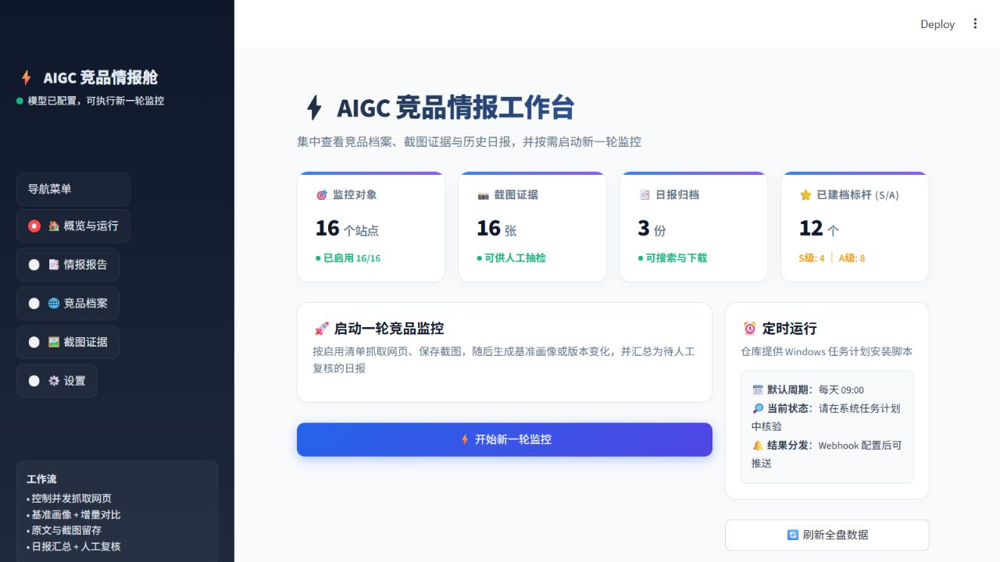
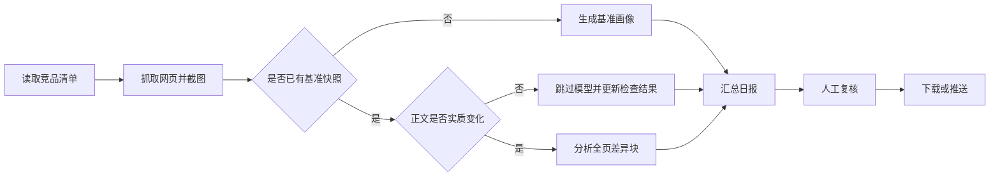

# AIGC 竞品态势感知 Agent

AIGC 竞品态势感知 Agent 是一个自动化竞品信息采集与分析工具，用于定期抓取竞品网站、保存页面证据、识别版本变化，并生成结构化 Markdown 日报。

项目提供 Streamlit 可视化工作台，可集中管理监控站点、查看竞品档案、浏览截图、检索历史报告，并按需将结果推送至企业微信群。

> 当前版本为实验性项目。抓取结果和模型分析可能存在遗漏或误判，重要结论应结合页面原文与截图人工复核。



## 功能概览

- **竞品清单管理**：添加、编辑、启用或停用监控站点；
- **网页抓取**：使用 Crawl4AI 控制并发抓取网页正文；
- **截图存证**：保存页面渲染截图，便于回看和人工核验；
- **基准画像**：首次抓取时生成产品定位、核心功能、商业模式等基础档案；
- **增量对比**：先规范化正文并执行确定性差异预筛，仅在存在实质变化时调用模型；
- **证据校验**：模型先返回受限 JSON，本地逐条匹配新旧正文引文后再渲染报告；
- **日报生成**：汇总各站点变化，生成带时间戳的 Markdown 报告；
- **可视化查询**：通过工作台查看概览、历史报告、竞品档案和截图；
- **结果分发**：支持下载报告，并可选推送至企业微信群机器人；
- **定时执行**：提供 Windows 任务计划注册脚本。

仓库的 `data/` 和 `reports/` 目录附带演示数据，可在不配置模型的情况下浏览工作台。

## 工作流程



核心流程由 4 个 LangGraph 节点组成：

1. `crawl_all`：抓取启用站点并保存截图；
2. `compare_all`：建立基准画像或执行增量对比；
3. `generate_report`：汇总本次变化并生成日报；
4. `push_to_wecom`：根据配置决定是否推送企业微信。

当前工作流为线性流程，LangGraph 主要用于管理节点顺序和共享状态。

## 技术栈

| 组件 | 用途 |
| --- | --- |
| Python | 核心运行环境 |
| Crawl4AI | 网页抓取与页面截图 |
| OpenAI Compatible API | 基准画像、增量分析与日报总结 |
| LangGraph | 工作流编排与状态传递 |
| Streamlit | 可视化工作台 |
| HTTPX | 企业微信 Webhook 请求 |

## 快速开始

### 环境要求

- Python 3.11（推荐）
- Chromium / Playwright 相关运行环境
- 执行新一轮分析时，需要可访问的 OpenAI 兼容 Chat Completions 接口

### 1. 获取项目

```bash
git clone https://github.com/juin20260102-oss/aigc-competitor-agent-intelligence.git
cd aigc-competitor-agent-intelligence
```

以下命令均需在项目根目录执行。

### 2. 安装依赖

Windows：

```powershell
python -m venv .venv
.venv\Scripts\activate
python -m pip install -r requirements.txt
crawl4ai-setup
```

macOS / Linux：

```bash
python -m venv .venv
source .venv/bin/activate
python -m pip install -r requirements.txt
crawl4ai-setup
```

### 3. 配置环境变量

Windows：

```powershell
Copy-Item .env.example .env
```

macOS / Linux：

```bash
cp .env.example .env
```

编辑 `.env`：

```dotenv
OPENAI_API_KEY=your_api_key
OPENAI_BASE_URL=https://dashscope.aliyuncs.com/compatible-mode/v1
MODEL_NAME=qwen3.7-flash
MODEL_BASE_URL_ALLOWLIST=https://dashscope.aliyuncs.com/compatible-mode/v1,https://api.openai.com/v1

# 可选
WECOM_WEBHOOK=
APP_ACCESS_PASSWORD=
```

运行截图、快照、日志和日报默认写入项目下的 `runtime/`。如需写到其他位置，可配置 `AGENT_RUNTIME_DIR`；仓库自带的 `data/` 与 `reports/` 只作为演示数据读取，不会再被新运行覆盖。

控制台默认只监听 `127.0.0.1`。如需经局域网或公网访问，应在前方部署带 TLS 与身份认证的反向代理，并设置 `APP_ACCESS_PASSWORD` 作为第二道访问保护。设置页只能保存 `MODEL_BASE_URL_ALLOWLIST` 中的模型端点；修改端点时必须同时重新输入 API Key。企业微信 Webhook 仅接受官方 `qyapi.weixin.qq.com` HTTPS 地址。

示例默认使用阿里云百炼的 OpenAI 兼容端点，也可以替换为其他兼容 Chat Completions API。`.env` 已加入 Git 忽略列表。Streamlit 设置页只对 Key 进行掩码显示，实际内容仍以明文形式保存在本地 `.env` 文件中。

### 4. 启动工作台

```bash
python -m streamlit run app.py
```

默认访问地址：`http://localhost:8501`。

Windows 用户也可以双击 `run_gui.bat`。未配置 API Key 时，工作台仍可浏览仓库中的演示数据，但不能执行新一轮分析。

### 5. 命令行运行

```bash
python step3_agent.py
```

运行时间与模型消耗取决于启用站点数量、网页响应速度、页面长度和模型配置。首次使用时建议只启用少量站点测试。

## 运行模式

| 模式 | 是否需要 API Key | 说明 |
| --- | --- | --- |
| 浏览演示数据 | 否 | 启动 Streamlit 后查看仓库内已有的档案、截图和日报 |
| 工作台执行 | 是 | 在“概览与运行”页面启动完整流程，并查看实时进度与最近日志 |
| 命令行执行 | 是 | 运行 `step3_agent.py`，执行与工作台相同的核心工作流 |
| Windows 定时执行 | 是 | 由 `run_daily.bat` 调用核心工作流，并写入调度日志 |

企业微信 Webhook 配置后，核心工作流会根据本次结果决定是否推送；消息内容受企业微信 Markdown 长度限制，仅发送报告前部内容。

## 竞品配置

监控清单位于 `data/competitors.json`，也可以在工作台的“竞品档案”页面中维护。

示例：

```json
[
  {
    "name": "Example",
    "url": "https://example.com",
    "enabled": true
  }
]
```

配置修改会影响下一次运行；已存在的历史快照不会自动删除。

## 输出文件

| 路径 | 内容 |
| --- | --- |
| `runtime/data/snapshots/*_latest.json` | 最新正文、规范化哈希、基准画像和变化记录 |
| `runtime/data/screenshots/*_latest.png` | 最近一次页面截图 |
| `runtime/data/logs/last_run.log` | 工作台最近一次执行日志 |
| `runtime/runs/<run_id>/<site_key>/` | 不可变正文、规范化文本、截图、结构化分析与哈希清单 |
| `runtime/data/latest_run.json` | 最近一次完整运行清单的位置与 SHA-256 |
| `runtime/reports/daily_report_*.md` | 带时间戳的综合日报 |

快照和截图使用 `*_latest` 文件名：截图在页面抓取成功后覆盖，快照仅在对应模型分析成功后覆盖；日报按运行时间单独保存。

正文预筛采用规范化哈希与按行差异算法：忽略图片地址及常见追踪参数，但保留有业务意义的链接目标、价格和版本号。站点文件名由可读前缀与 URL 哈希组成，以避免路径碰撞和超长文件名；首次读取旧命名的运行时快照时会复制为新名称，旧文件仍保留。

每次完整运行还会生成独立的不可变证据目录，`manifest.json` 记录所有文件的大小与 SHA-256。旧 `data/snapshots` 可先运行 `python migrate_legacy_evidence.py` 预览，再加 `--apply` 执行只复制迁移。保留策略默认关闭；仅在显式设置 `EVIDENCE_RETENTION_DAYS` 或 `EVIDENCE_MAX_RUNS` 为正数时清理已完成的旧运行。

### 失败与覆盖规则

- 单个站点抓取失败不会中断其他站点，失败原因会写入当次日报；
- 单个站点模型分析失败不会中断整批任务，快照保持上一次成功结果；
- 模型请求带有超时、有限重试；宏观总结失败时仍会生成降级日报；
- 模型端点不支持 JSON Mode 时会回退到提示词约束；无法解析或引文不匹配的事实会标记为“需人工复核”；
- 页面截图在抓取成功时更新，可能早于对应快照的模型分析结果；
- 快照、截图和日报采用临时文件加原子替换，降低中断时的文件损坏风险；
- 跨进程锁会阻止 GUI、CLI 和定时任务同时写入同一运行目录。

### 数据流向

- 网页正文和截图保存在本地项目目录；
- 用于分析的网页正文会发送至 `.env` 中配置的模型接口；
- 截图当前不会发送给模型；
- 配置企业微信 Webhook 后，报告摘要会发送至对应机器人接口。

请勿将包含敏感信息、受访问控制内容或不允许外发的数据加入监控清单。

## 项目结构

```text
.
├── app.py                        # Streamlit 入口
├── ui/
│   ├── dashboard.py             # 概览、运行进度与日志
│   ├── reports.py               # 历史报告与结果分发
│   ├── competitors.py           # 竞品清单与档案
│   ├── gallery.py               # 截图证据
│   └── settings.py              # 模型与通知配置
├── step1_fetch_and_analyze.py    # 单站抓取与画像测试
├── step2_compare.py              # 单站版本对比测试
├── step3_agent.py                # 竞品页面监控工作流
├── agent_utils.py                # 安全校验、变化预筛、原子写入与运行锁
├── data/
│   ├── competitors.json
│   ├── snapshots/
│   └── screenshots/
├── reports/                      # 随仓库提供的演示日报
├── runtime/                      # 本地运行产物（Git 忽略）
├── tests/
├── run_gui.bat
├── run_daily.bat
├── setup_scheduler.ps1
├── .env.example
└── requirements.txt
```

## 定时运行

Windows 可使用项目中的任务计划脚本：

```powershell
powershell -ExecutionPolicy Bypass -File .\setup_scheduler.ps1
```

脚本默认创建每天 `09:00` 执行的任务。安装后应在 Windows“任务计划程序”中核对运行账户、工作目录和执行状态。

## 已知限制

- 默认按配置 URL 抓取，无法覆盖竞品的全部页面和登录后功能；
- 长页面会受到模型输入窗口限制，可能遗漏页面后部变化；
- 变化预筛使用文本规范化和阈值，极小但重要的变化仍应结合定期人工抽检；
- 截图仅用于人工存证，当前未作为多模态模型输入；
- 动态数字、倒计时和推荐内容可能被识别为页面变化；
- 原文引用由提示词约束，尚未增加独立的引用校验节点；
- 快照与截图采用最新版本覆盖方式，不具备完整的不可变证据链；
- 站点反爬、登录限制或前端结构变化可能导致抓取失败；
- 模型生成的总结与建议不应直接作为商业决策依据。

## 测试

```bash
python -m unittest discover -s tests -v
```

测试覆盖正文规范化与变化判定、URL 私网拦截、原子写入、跨进程锁、配置换行注入防护和错误消息清洗。
